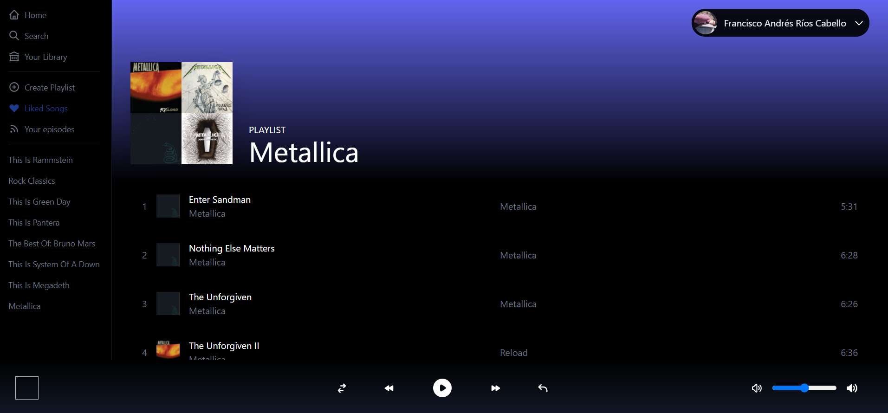

# Spotify Clone using Spotify API, Next.js & NextAuth.js


<details>
  <summary>Table of Contents</summary>
  <ol>
    <li>
      <a href="#about-the-project">About The Project</a>
      <ul>
        <li><a href="#built-with">Built With</a></li>
      </ul>
    </li>
    <li>
      <a href="#getting-started">Getting Started</a>
      <ul>
        <li><a href="#prerequisites">Prerequisites</a></li>
        <li><a href="#installation">Installation</a></li>
      </ul>
    </li>
    <li><a href="#usage">Usage</a></li>

  </ol>
</details>


## About The Project 




## Built With

* [Next.js](https://nextjs.org/)
* [React.js](https://reactjs.org/)
* [TailwindCSS 3.0](https://tailwindcss.com/)
* [NextAuth.js](https://next-auth.js.org/)
* [Recoil](https://recoiljs.org/)
* [spotify-web-api-node](https://github.com/thelinmichael/spotify-web-api-node)

## Getting Started

### Prerequisites
    You have to get Node.js installed on your PC
    You have to get a prior React & Next.js knowledge
### Installation

1. Clone the repo
   ```sh
   git clone https://github.com/panchoarc/spotify-clone-nextjs.git
   ```
2. Install NPM packages
   ```sh
   npm install
   ```
3. Get API Keys at [Spotify Developers](https://developer.spotify.com/dashboard/login)
4. Login With your credentials in the page that appears.
5. Create a project in the Dashboard.
6. When you get the credentials, you have to edit some settings in the page
7. Create a redirect URI for that purpose.
    ```sh
    http://localhost:3000/api/auth/callback/spotify
    ```
8. Create a .env.local file with the following environment variables
    ```sh
        NEXTAUTH_URL=
        NEXT_PUBLIC_CLIENT_ID=
        NEXT_PUBLIC_CLIENT_SECRET=
        JWT_SECRET=
    ```


